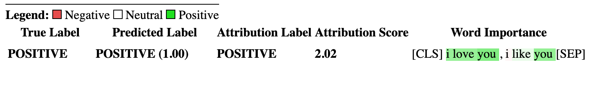
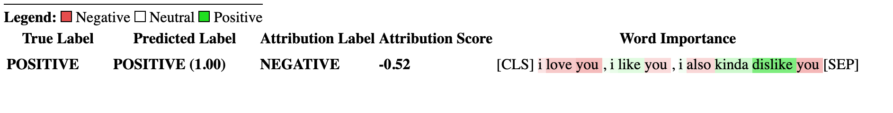

# Transformers Interpret
[](https://app.circleci.com/pipelines/github/cdpierse/transformers-interpret)


Transformers Interpret is a model explainability tool designed to work exclusively with 🤗 transformers.

In line with the philosophy of the transformers package tranformers interpret allows any transformers model to be explained in just two lines. It even supports visualizations in both notebooks and as savable html files.

This package stands on the shoulders of the the incredible work being done by the teams at [Pytorch Captum](https://captum.ai/) and [Hugging Face](https://huggingface.co/) and would not exist if not for the amazing job they are both doing in the fields of nlp and model interpretability respectively.

## Install

I recommend Python 3.6 or higher, Pytorch 1.5.0 or higher, transformers v3.0.0 or higher, and captum 0.3.1 (**required**). The package does not work with Python 2.7.

```bash
pip install transformers-interpret
```

## Quick Start

Let's start by importing the auto model and tokenizer class from transformers and initializing a model and tokenizer.

For this example we are using `distilbert-base-uncased-finetuned-sst-2-english` a distilbert model finetuned on a sentiment analysis task.

```python
from transformers import AutoModelForSequenceClassification, AutoTokenizer
model = AutoModelForSequenceClassification.from_pretrained("distilbert-base-uncased-finetuned-sst-2-english")
tokenizer = AutoTokenizer.from_pretrained("distilbert-base-uncased-finetuned-sst-2-english")
```

With both the model and tokenizer initialized we are now able to get get some explanations on some input text.

```python
from transformers_interpret import SequenceClassificationExplainer
cls_explainer = SequenceClassificationExplainer("I love you, I like you", model, tokenizer)
attributions = cls_explainer()
```

Returns the list of tuples below.

```python
>>> attributions.word_attributions
[('BOS_TOKEN', 0.0),
 ('I', 0.46820529249283205),
 ('love', 0.46061853275727177),
 ('you', 0.566412765400519),
 (',', -0.017154456486408547),
 ('I', -0.053763869433472),
 ('like', 0.10987746237531228),
 ('you', 0.48221682341218103),
 ('EOS_TOKEN', 0.0)]
```

Positive attribution numbers indicate a word contributes positively towards the predicted class, negative numbers indicate a word contributes negatively towards the predicted class. Here we can see that **I love you** gets the most attention.

In case you want to know what the predicted class actually is:

```python
>>> cls_explainer.predicted_class_index
array(1)
```

And if the model has label names for each class

```python
>>> cls_explainer.predicted_class_name
'POSITIVE'
```

### Visualizing attributions

Sometimes the numeric attributions can be difficult to read particularly in instances where there is a lot of text. To help with that there
is also an inbuilt visualize method that utilizes Captum's in built viz library to create a HTML file highlighting attributions.

If you are in a notebook call the `visualize()` method will display the visualization in line, otherwise you can pass a filepath in as an argument and a html file will be created so you can view the explanation in your browser.

```python
cls_explainer.visualize("distilbert_viz.html")
```



### Explaining Attributions for Non Predicted Class

Attribution explanations are not limited to the predicted class. Let's test a more complex sentence that contains mixed sentiments.

In the example below we pass `class_name="NEGATIVE"` as an argument indicating we would like the attributions to be explained for the **NEGATIVE** class regardless of what the actual prediction is. Effectively because this is a binary classifier we are getting the inverse attributions.

```python
cls_explainer = SequenceClassificationExplainer("I love you, I like you, I also kinda dislike you", model, tokenizer)
attributions = cls_explainer(class_name="NEGATIVE")
```

This still returns a prediction of the **POSITIVE** class

```python
>>> cls_explainer.predicted_class_name
'POSITIVE'
```

But when we visualize the attributions we can see that the words "**...kinda dislike**" in the sentence are contributing to a prediction of the "NEGATIVE"
class.

```python
cls_explainer.visualize("distilbert_negative_attr.html")
```



Getting attributions for different classes is particularly insightful for multiclass problems as it allows you to inspect model predictions for a number of different classes and sanity check that the model is "looking" at the right things.

For a detailed example of this please checkout this [multiclass classification notebook](notebooks/multiclass_classification_example.ipynb)

## Future Development

This package is still in its early days and there is hopefully much more planned. For a 1.0.0 release I'm aiming to have:

- Proper documentation site
- Support for Question Answering models
- Support for NER models
- Support for Multiple Choice models (not sure how feasible this is)
- Ability to show attributions for each layer rather than a summary of all layers
- Additional attribution methods
- In depth examples
- and more...

## Questions / Get In Touch

The main contributor to this repository is [@cdpierse](https://github.com/cdpierse).

If you have any questions, suggestions, or would like to make a contribution (please do 😁) please get in touch at charlespierse@gmail.com

I'd also highly suggest checking out [Captum](https://captum.ai/) if you find model explainability and interpretability interesting. They are doing amazing and important work.

## Captum Links

Below are some links I used to help me get this package together using captum. Thank you to @davidefiocco for your very insightful GIST.

- [Link to useful GIST on captum](https://gist.github.com/davidefiocco/3e1a0ed030792230a33c726c61f6b3a5)
- [Link to runnable colab of captum with BERT](https://colab.research.google.com/drive/1snFbxdVDtL3JEFW7GNfRs1PZKgNHfoNz)
